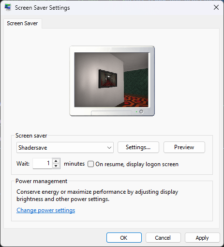

# :rainbow: Shadersave

Shadersave is a Windows screensaver that can run Shadertoy shaders locally under OpenGL 4.3 core.

> [!WARNING]
> This is still under development and does not have most features implemented.

# :world_map: Roadmap

- [ ] Add image loading support.
- [x] Rewrite renderer entirely.
- [x] Get buffers and channels working.
- [x] Rewrite shadertoy loader.
- [x] Implement remaining global variables.
- [x] Get basic conversion code working.
- [x] Get OpenGL renderer working.
- [x] Clean up the code.
- [x] Add support for loading from files instead of resources.
- [x] Add config dialogue using Win32.
- [x] Come up with something to get full 144Hz displaying.

# :warning: Limitations

- Audio and VR shaders will not be supported.
- Mouse and/or keyboard input wont be supported for obvious reasons.
- Cubemap shaders will not be supported.

# :hammer_and_wrench: Building

To build this, you will need the following:
- Visual Studio 2022.
- The **Desktop development with C++** workload.
- The **Windows SDK**.

You must also place [GLEW](https://glew.sourceforge.net/) under the **"libs"** folder.

# :beetle: Debugging

Debugging screensavers is kind of a hassle, but it can be done.

1. Open a Win32 window, for example Control Panel.
2. Grab its window handle with Spy++ or some other software.
3. Convert the handle from hexadecimal to decimal.
4. Go into **Shadersave -> Properties -> Debugging**.
5. On **Command Arguments**, write **/p (window handle)** and hit **Apply**.
6. You can now debug the screensaver as long as you don't close the window you opened.

> [!TIP]
> **Renderdoc** can be used this way as well, if you want to debug the graphics side.

To debug the configuration dialog, do the following:

1. Do steps 1 to 4 from above.
2. On **Command Arguments**, write **/c:(window handle)** and hit **Apply**.
3. You can now debug the config dialog.

# :camera: Screenshots

[*pow(The Shining, 2.0)*](https://www.shadertoy.com/view/tlyfDV) by **dean_the_coder**  

[*Barber*](https://www.shadertoy.com/view/MsjXDm) by **okro**  

[*Cook-Torrance*](https://www.shadertoy.com/view/XsXXDB) by **xbe**  

[*Splitting DNA*](https://www.shadertoy.com/view/4d2cWd) by **BigWIngs**  

