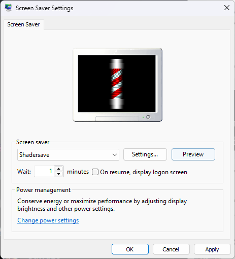
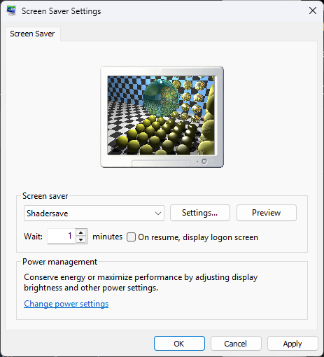
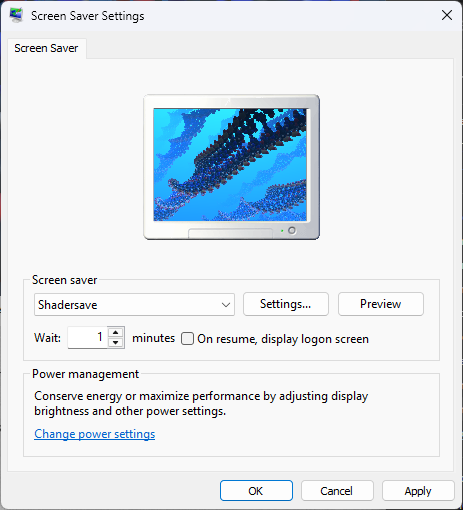

# :rainbow: Shadersave

Shadersave is a Windows screensaver that can run Shadertoy shaders locally under OpenGL.

> [!WARNING]
> This is still under development and does not have most features implemented.

# :world_map: Roadmap

- [ ] Get buffers and channels working
- [x] Get basic conversion code working.
- [x] Get OpenGL renderer working.
- [x] Clean up the code.
- [x] Add support for loading from files instead of resources.
- [x] Add config dialogue using Win32.
- [x] Come up with something to get full 144Hz displaying.

# :warning: Limitations

- Audio and VR shaders will not be supported.
- Mouse and/or keyboard input wont be supported for obvious reasons.

# :hammer_and_wrench: Building

To build this, you need Visual Studio 2022 with the C++ workload installed alongside the Windows 11 SDK.  
You must also place the libraries below in a "lib" folder.

- [boost::regex](https://github.com/boostorg/regex)
- [GLEW](https://glew.sourceforge.net/)
- [GLM](https://github.com/g-truc/glm)

I still haven't heard of ways to debug screensavers properly.

# :camera: Screenshots

[*Barber*](https://www.shadertoy.com/view/MsjXDm) by **okro**  

[*Cook-Torrance*](https://www.shadertoy.com/view/XsXXDB) by **xbe**  

[*Splitting DNA*](https://www.shadertoy.com/view/4d2cWd) by **BigWIngs**  

